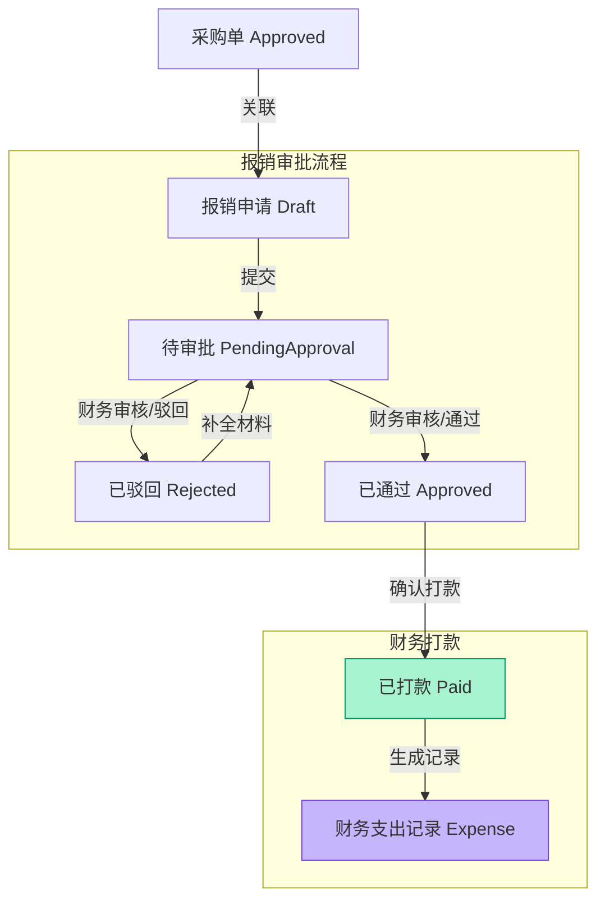

# 财务与付款流程 logic visualization

本文档详细说明财务报销、打款流程，以及财务记账的核心逻辑。

## 核心流程图



## 状态流转详解

| 状态 (Status) | 说明 | 触发动作 |
|-----|-----|-----|
| **draft** | 报销单草稿 | 用户创建/撤回/驳回后编辑 |
| **pending_approval** | 等待财务审核 | 用户提交申请 |
| **approved** | 财务审核通过，等待打款 | 财务点击"通过" |
| **rejected** | 财务驳回申请 | 财务点击"驳回"，需填写原因 |
| **paid** | 财务确认已打款 | 财务点击"确认打款" |

## 关键业务规则

1.  **报销关联**:
    *   **来源**: 报销单可以关联 `Purchase` (采购单) 或直接创建 (无关联)。
    *   **限制**: 若关联采购单，该采购单必须是 `approved` 状态且**未被其他报销单关联**。
    *   **入库检查**: 若关联采购单，系统会检查该采购单对应的物品是否已完成 **入库 (Inbound)** 操作。

2.  **财务审核**:
    *   财务人员需核对发票、收据等附件。
    *   若信息不全，可直接驳回，状态变更为 `rejected`。

3.  **打款与记账**:
    *   只有状态为 `approved` 或 `pending_approval` (视配置而定) 的报销单可以执行打款。
    *   **自动记账**: 打款成功 (`paid`) 后，系统会自动在 `Finance` 模块生成一条支出记录 (`Expense`)。
    *   支出记录会自动关联由于哪个报销单产生 (`reimbursementId`)。

4.  **数据一致性**:
    *   报销单总金额必须与关联的采购单金额一致 (若为全额关联)。
    *   打款备注 (`paymentNote`) 会同步记录到财务支出记录中。

## 数据结构摘要 (TypeScript)

```typescript
type ReimbursementStatus = 'draft' | 'pending_approval' | 'approved' | 'rejected' | 'paid';

interface ReimbursementRecord {
  id: string;
  reimbursementNumber: string; // RB+年月+序号
  amount: number;
  
  // 关联信息
  sourceType: 'purchase' | 'direct';
  sourcePurchaseId?: string;
  
  // 附件证据
  invoiceImages: string[];
  receiptImages: string[];
  
  // 支付信息
  paidAt?: Date;
  paidBy?: string; // 财务人员ID
  paymentNote?: string;
}

interface FinanceRecord {
  id: string;
  type: 'expense' | 'income'; // 此处为 expense
  amount: number;
  reimbursementId?: string; // 关联的报销单
  status: 'cleared'; // 自动结清
}
```
