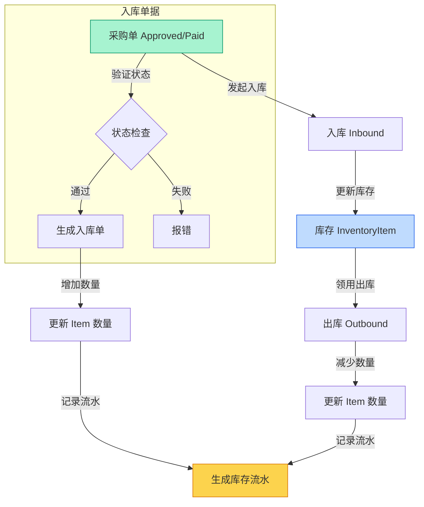

# 库存管理流程 logic visualization

本文档详细说明库存管理的入库、出库、盘点等核心逻辑。

## 核心流程图



## 关键业务规则

1.  **入库 (Inbound)**:
    *   **来源**: 必须关联一个 `approved` 或 `paid` 状态的采购单。
    *   **限制**: 入库数量不能超过采购单的采购数量 (剩余可入库数)。
    *   **权限**: 只有拥有入库权限的角色才能执行。
    *   **验证**: 系统会检查采购单是否属于当前用户 (视权限配置而定) 以及状态是否合法。

2.  **出库 (Outbound)**:
    *   **来源**: 领用申请、销售出库等。
    *   **库存检查**: 出库前必须检查当前库存 (`currentQuantity`) 是否充足。
    *   **预占**: 部分场景下支持库存预占 (`reservedQuantity`)。

3.  **库存流水 (Movement)**:
    *   所有的库存变更 (入库、出库、盘点盈亏) 都会生成一条库存流水记录。
    *   流水记录包含：变更类型 (`inbound`/`outbound`/`check`)、数量、关联单据号、操作人等。
    *   流水是库存追溯和审计的唯一依据。

## 数据结构摘要 (TypeScript)

```typescript
type MovementDirection = 'inbound' | 'outbound' | 'check';

interface InventoryItem {
  id: string;
  name: string;
  currentQuantity: number; // 当前实际库存
  reservedQuantity: number; // 被预占库存
}

interface InventoryMovement {
  id: string;
  itemId: string;
  direction: MovementDirection;
  quantity: number; // 变更数量 (始终为正数，方向由 direction 决定)
  
  // 关联单据
  relatedPurchaseId?: string;
  relatedOrderId?: string;
  
  operatorId: string;
  createdAt: Date;
}
```
