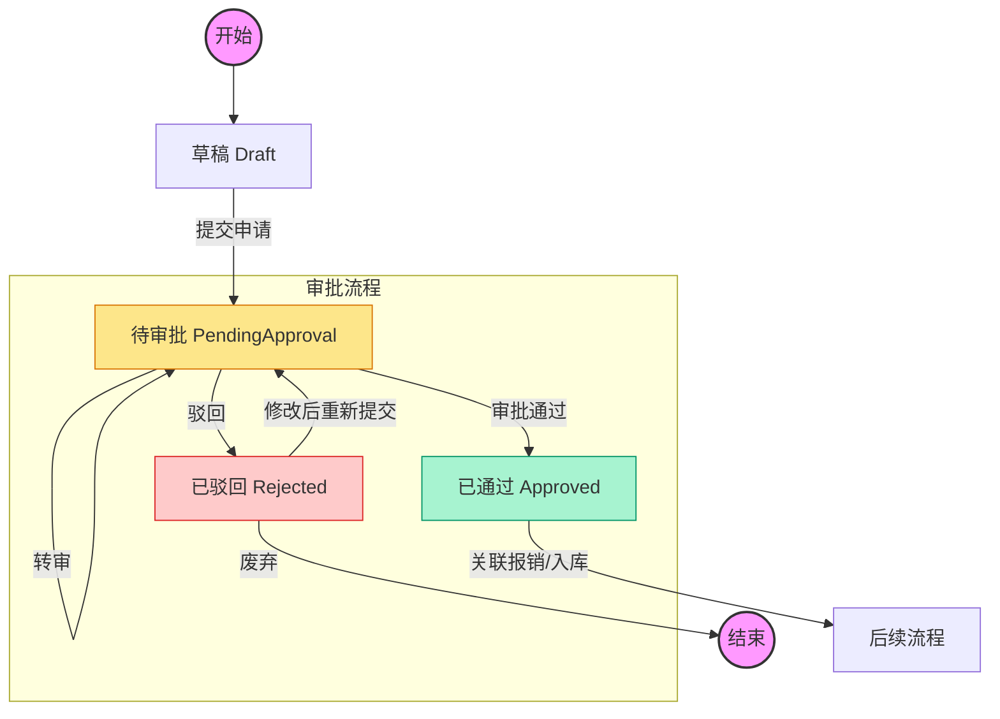

# 采购与审批流程 logic visualization

本文档描述系统中采购申请、审批、以及状态流转的核心逻辑。

## 核心流程图



## 状态流转详解

| 状态 (Status) | 说明 | 可执行操作 | 权限要求 |
|Data Transfer Object|-------------|-------------|-------------|
| **draft** (草稿) | 初始状态，仅创建者可见 | 编辑、提交、删除 | 创建者 |
| **pending_approval** (待审批) | 已提交，等待审批人处理 | 通过、驳回、转审、撤回 | 审批人 / 创建者(撤回) |
| **approved** (已通过) | 审批通过，可进行后续业务 | 提交报销、入库 | 相关业务人员 |
| **rejected** (已驳回) | 审批不通过 | 编辑、重新提交 | 创建者 |

## 关键业务规则

1.  **提交限制**:
    *   必须填写必要的采购明细（物品、数量、单价）。
    *   如果是"线上购买"，必须填写平台名称；线下购买需填写地点。
    *   **预算控制**: 提交时会检查部门预算，若超出预算将无法提交。
    *   系统会自动根据申请人角色或部门分配默认审批人。

2.  **审批操作**:
    *   **通过**: 采购单状态变为 `approved`，触发通知。
    *   **驳回**: 必须填写驳回原因，状态变为 `rejected`，通知创建者。
    *   **转审**: 审批人可将待办任务转交给其他**具有审批权限**的人员，需填写转审说明。

3.  **撤回**:
    *   创建者在审批尚未完成（状态为 `pending_approval`）时，可以主动撤回申请，状态变回 `draft`。

4.  **后续关联**:
    *   只有状态为 `approved` 的采购单才能发起 **入库 (Inventory Inbound)** 或 **报销 (Reimbursement)**。
    *   对公转账 (Corporate Transfer) 的采购单**不能**发起报销。

## 数据结构摘要 (TypeScript)

```typescript
type PurchaseStatus = 'draft' | 'pending_approval' | 'approved' | 'rejected' | 'paid';

interface PurchaseRecord {
  id: string;
  purchaseNumber: string; // P+年月+序号 (例如 P202310001)
  status: PurchaseStatus;
  
  // 申请人信息
  applicantId: string;
  departmentId: string;
  
  // 采购详情
  itemName: string;
  quantity: number;
  unitPrice: number;
  totalAmount: number; // 自动计算
  
  // 审批链
  pendingApproverId?: string;
  approvedBy?: string;
  approvedAt?: Date;
}
```
